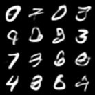
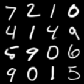
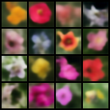
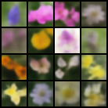
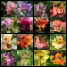
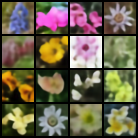
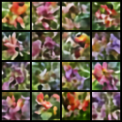
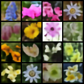

# simple VAE in PyTorch

use a encoder to map a image into a laten, then use MLP map laten to mean and log var, and accordingly sample noise, finally reconstuct original image from noise.

this code can sample a decent image on mnist data, but seem to fail in a more complex datasets like flower dataset.

# Results
## mnist
1. sampled image

1. reconstructed image

## flower dataset

### when reg loss w = 0.1
1. sampled image

1. reconstructed image

### when reg loss w = 0.01
1. sampled image

1. reconstructed image

### when reg loss w = 0.0001
1. sampled image

1. reconstructed image

